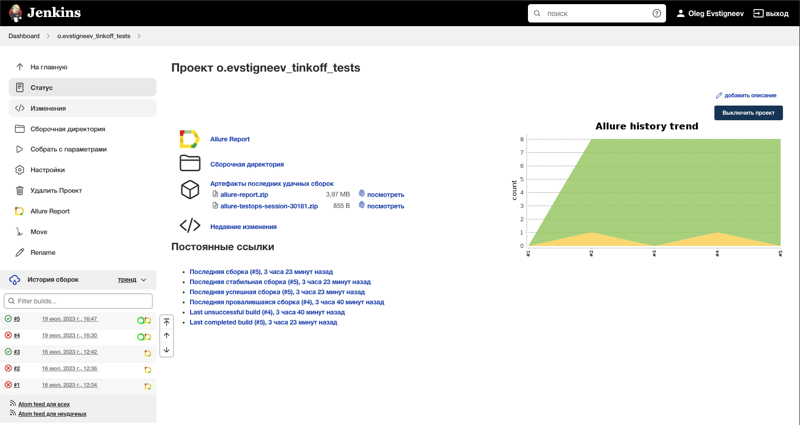
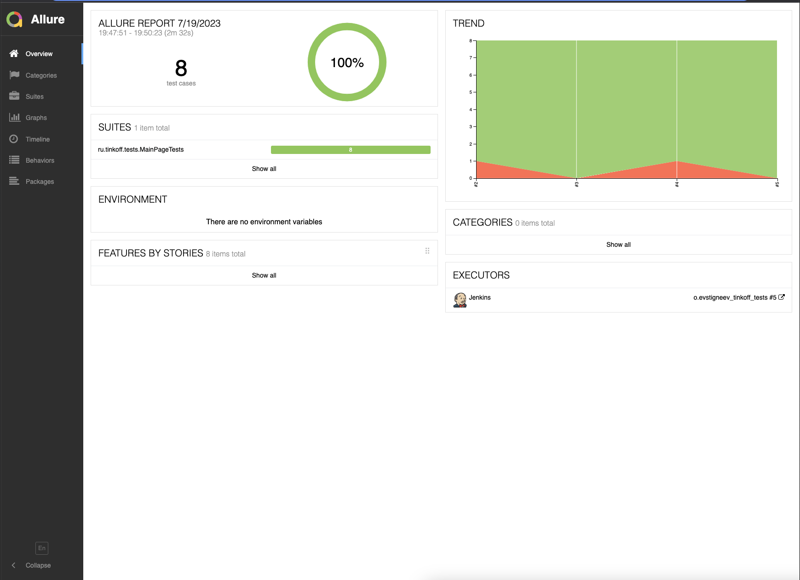
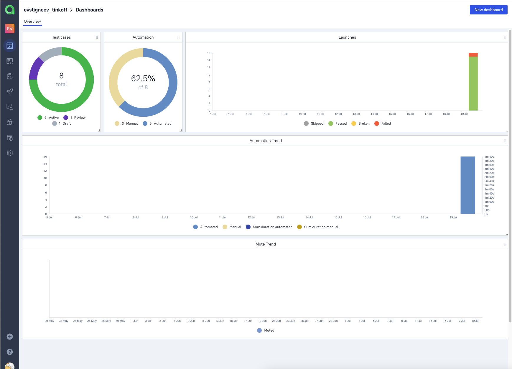
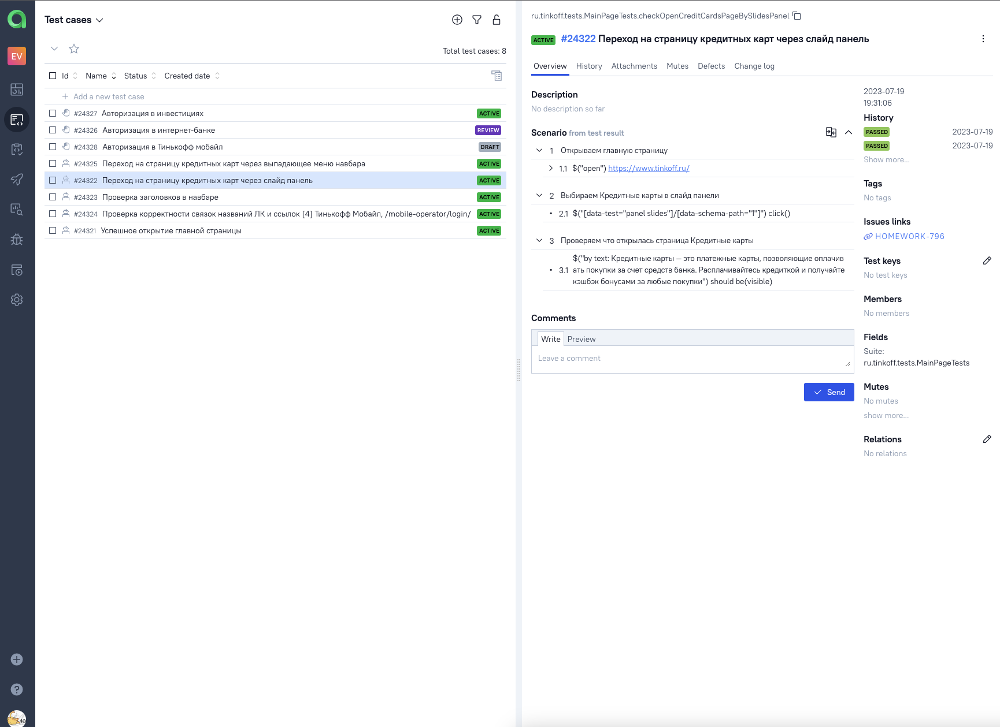
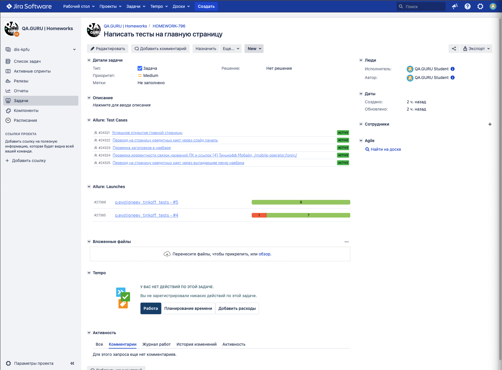
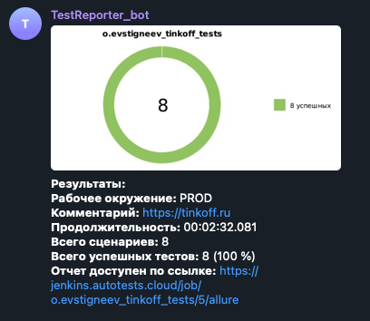
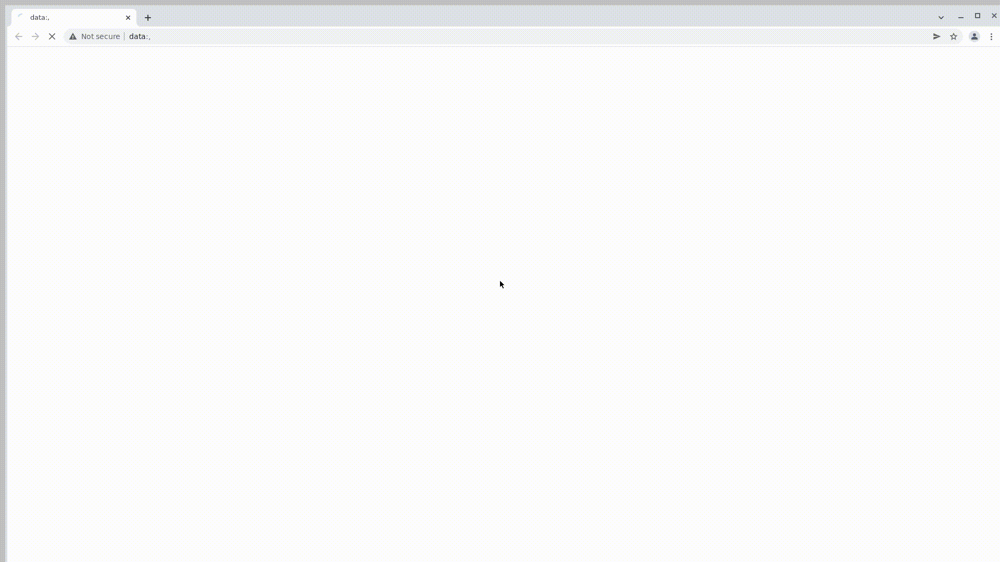

# Проект по автоматизации тестовых сценариев для сайта банка Тинькофф
## :scroll: Содержание:

- [Используемый стек](#computer-используемый-стек)
- [Запуск автотестов](#arrow_forward-запуск-автотестов)
- [Сборка в Jenkins](#-сборка-в-jenkins)
- [Пример Allure-отчета](#-пример-allure-отчета)
- [Интеграция с Allure TestOps](#-интеграция-с-allure-testOps)
- [Интеграция с Jira](#-интеграция-с-jira)
- [Уведомления в Telegram](#-уведомления-в-telegram)
- [Видео примера запуска тестов в Selenoid](#-видео-примера-запуска-теста-в-selenoid)

## :computer: Используемый стек

<p align="center">


</p>

Тесты написаны на языке <code>Java 17</code> с использованием фреймворков <code>JUnit 5</code> и [Selenide](https://selenide.org/), сборка - <code>Gradle</code>.
Для запуска браузеров используется [Selenoid](https://aerokube.com/selenoid/).
Для удаленного запуска используется джоба в <code>Jenkins</code> с формированием Allure-отчета и отправкой результатов в <code>Telegram</code> при помощи бота с использованием библиотеки [allure-notifications](https://github.com/qa-guru/allure-notifications). 
Настроена интеграция с <code>Allure TestOps</code> и <code>Jira</code>.

Allure-отчета содержит:
* Шаги теста;
* Скриншот страницы на последнем шаге;
* Page Source;
* Логи браузерной консоли;
* Видео выполнения теста.

## :arrow_forward: Запуск автотестов

### Запуск тестов из терминала
Локальный запуск:
```
gradle clean test -Denv=local
```
При выполнении данной команды в терминале IDE тесты запустятся удаленно в <code>Selenoid</code> на браузере <code>Chrome</code> версии <code>100.0</code> с разрешением <code>1920х1080</code>:
```
gradle clean test -Denv=remote
```


##  Сборка в Jenkins

Для запуска [сборки](https://jenkins.autotests.cloud/job/o.evstigneev_tinkoff_tests/) необходимо перейти в раздел <code>Собрать с параметрами</code>, указать нужные параметры и нажать кнопку <code>Собрать</code>.
<p align="center">

</p>
Параметры сборки в Jenkins:

- *browser (браузер, по умолчанию chrome)*
- *browserVersion (версия браузера, по умолчанию 100.0)*
- *browserSize (размер окна браузера, по умолчанию 1920x1080)*
- *baseUrl (адрес сайта)*
- *selenoid (логин, пароль и адрес удаленного сервера Selenoid)*

После выполнения сборки, в блоке <code>История сборок</code> напротив номера сборки появятся значки <code>Allure Report</code> и <code>Allure TestOps</code>, при клике на которые откроется страница с сформированным html-отчетом и тестовой документацией соответственно.

##  Пример Allure-отчета
### Overview

<p align="center">

</p>

##  Интеграция с Allure TestOps

<p align="center">

</p>

### Пример теста

<p align="center">

</p>

##  Интеграция с Jira

Реализована интеграция <code>Allure TestOps</code> с <code>Jira</code>, в тикете отображается, какие тест-кейсы были написаны в рамках задачи и результат их прогона.

<p align="center">

</p>

###  Уведомления в Telegram с использованием бота

После завершения сборки бот автоматически отправляет сообщение в <code>Telegram</code> с отчетом о прогоне тестов.

<p align="center">

</p>

###  Видео примера запуска тестов в Selenoid

В отчетах Allure для каждого теста прикреплен скриншот последнего шага и видео прохождения теста
<p align="center">
  
</p>